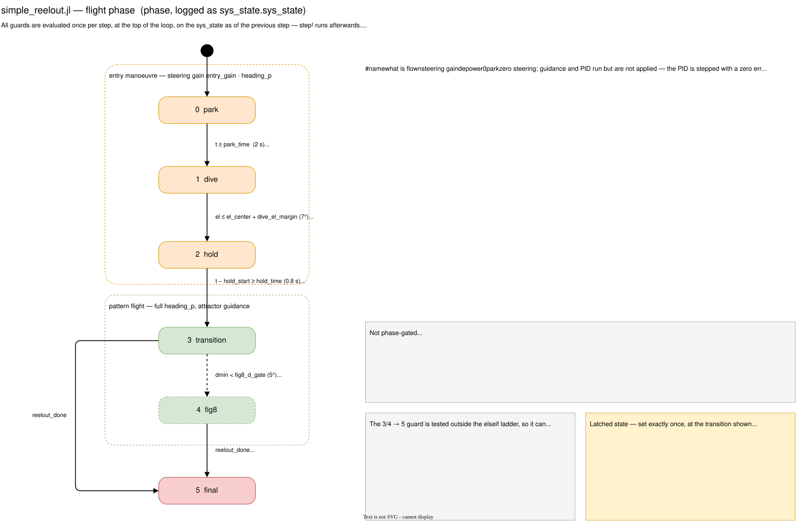
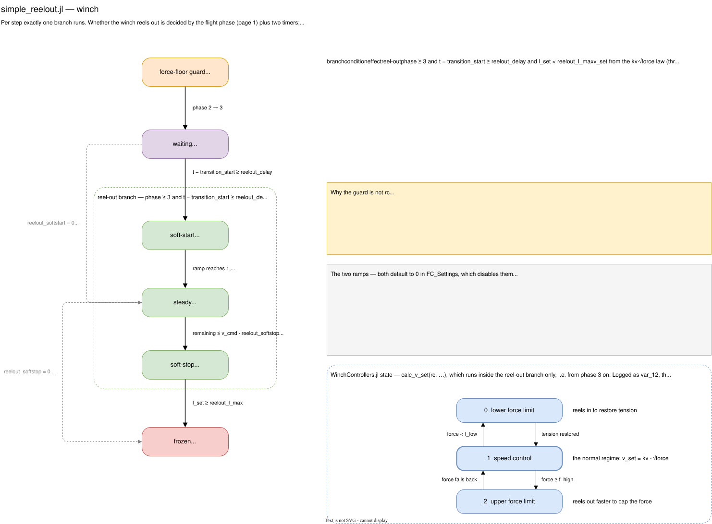

# The state machine of the reel-out controller

Reference for the phases of `examples/simple_reelout.jl` and the conditions that
move between them. There are **two** state machines running side by side:

1. The **flight phase** (`phase`, logged as `sys_state.sys_state`), sequencing
   the entry manoeuvre and deciding what steering gain, depower and winch
   behaviour is in force. Phases 0-4 live in
   [`src/course_controller.jl`](../src/course_controller.jl)'s `CourseController`
   (PlanCourseControl.md, 2026-08-17) and are shared with `simple_fig8.jl` and
   `simple_fig8_live.jl`, which never advance past 4; phase 5 is winch-triggered
   and stays this script's business, applied through `set_phase!(cc, 5)`.
2. The **winch state**, which is partly the same `phase` (it gates *whether* the
   winch reels out) and partly `WinchControllers.jl`'s own three-state controller
   (logged as `var_12`), which decides *how fast*.

All conditions below are evaluated once per step, at the top of the loop, on the
`sys_state` **as of the previous step** — `step!` runs afterwards.

Both machines are also drawn in [`reelout_state_machine.drawio`](reelout_state_machine.drawio)
(page 1 = flight phases, page 2 = winch). Edit that file and re-export with:

```bash
drawio -x -f svg -p 0 -o docs/reelout_state_machine_phases.svg docs/reelout_state_machine.drawio
drawio -x -f svg -p 1 -o docs/reelout_state_machine_winch.svg  docs/reelout_state_machine.drawio
```

## 1. Flight phases

| # | name | what is flown | steering gain | depower |
|:--|:-----|:--------------|:--------------|:--------|
| 0 | park | zero steering; guidance and PID run but are not applied | `entry_gain * heading_p` | `depower_setpoint` |
| 1 | dive | open-loop course `chi_dive` (≈ -85°, descending) | `entry_gain * heading_p` | `entry_depower` |
| 2 | hold | open-loop course `chi_hold` (-90°, horizontal) | `entry_gain * heading_p` | `entry_depower` |
| 3 | transition | attractor guidance engaged; winch starts reeling out | `heading_p` | `depower_setpoint` |
| 4 | fig8 | same as 3; a logging milestone only | `heading_p` | `depower_setpoint` |
| 5 | final | same as 3/4, reel-out finished, length frozen | `heading_p` | `depower_final` |

The phase never runs backwards: each transition is one-way and, once taken, its
guard is no longer tested.

### Transitions



| from | to | condition | source |
|:-----|:---|:----------|:-------|
| 0 park | 1 dive | `t >= ccs.park_time` — the parking time has elapsed. Nothing about the kite's state is checked; the park exists only to let the settling/init transients decay. | [course_controller.jl:208](../src/course_controller.jl#L208) |
| 1 dive | 2 hold | `elevation <= ccs.el_center + ccs.dive_el_margin` — the kite has descended to within `dive_el_margin` (7°) of the pattern-centre elevation. `hold_start` is latched to the current time here. | [course_controller.jl:210](../src/course_controller.jl#L210) |
| 2 hold | 3 transition | `t - hold_start >= ccs.hold_time` — the horizontal hold has lasted `hold_time` (0.8 s), so the kite arrives flat rather than still descending. This script separately latches its own `transition_start` on the same edge (comparing the phase `calc_steering` returns against the phase before the call); `reelout_delay` counts from it. | [course_controller.jl:213](../src/course_controller.jl#L213), [simple_reelout.jl:351](../examples/simple_reelout.jl#L351) |
| 3 transition | 4 fig8 | `dmin < ccs.fig8_d_gate` — the cross-track error to the pattern drops below 5° for the **first** time. Purely a milestone: it changes nothing in how the kite is flown or how the winch behaves; it only marks the start of the window the results section reports `v_app` over. | [course_controller.jl:215](../src/course_controller.jl#L215) |
| 3 or 4 | 5 final | `reelout_done` — either `l_set >= fcs.reelout_l_max` (the length setpoint has reached the reel-out target) or `fcs.n_fig_eight` complete laps have been flown, whichever fires first. `n_fig_eight = 0` disables the lap criterion. | [simple_reelout.jl:354](../examples/simple_reelout.jl#L354) |

Two details of the 3/4 -> 5 transition:

- It is applied by this script, **after** `calc_steering` returns, via
  `set_phase!(cc, 5)` — which can fire on the *same step* as a 3 -> 4 transition
  the ladder inside `calc_steering` just made, since the script also overrides
  the just-returned `rel_depower` to `depower_final` in that case. Reel-out
  finishing does not wait for settling.
- It is reachable from phase 3 directly. A run whose tracking never gets inside
  `fig8_d_gate` (so phase 4 never happens) still reaches `final` once the
  tether is reeled out — which is why the results section gates the reel-out
  numbers on phase 3, not phase 4.

There is **no** transition out of phase 5: the rest of the run is flown at
`depower_final` with a frozen length setpoint. There is no reel-in phase in this
script — it is a single reel-out, not a pumping cycle.

### What each phase changes

- **Steering (0 vs 1-5).** In phase 0 the PID is stepped with a zero error and
  its output discarded, so engagement in phase 1 is bumpless; from phase 1 on the
  output is applied.
- **Steering gain (0-2 vs 3-5).** The heading PID's gain is
  `entry_gain * heading_p` (25 %) during the entry and the full `heading_p` from
  phase 3. On top of that, the gain is always scaled by `v_app_ref / v_app`,
  independent of phase.
- **Course source (0-2 vs 3-5).** With `fig8_pure_course = true`, phases 3+ use
  pure course feedback; during the entry the feedback angle is blended from
  heading to course by kite speed.
- **Commanded course (1-2 vs the rest).** Phases 1 and 2 override the guidance
  with the open-loop `chi_dive` / `chi_hold`. The entry descent limiter
  (`entry_chi_max`, weighted by `w_lim`) applies wherever the guidance is far
  off the path, and is not itself phase-gated.
- **Depower.** `entry_depower` in phases 1-2, `depower_final` in phase 5,
  `depower_setpoint` otherwise (0, 3, 4).
- **Winch.** See below.

## 2. Winch: reel-out gating



The winch is driven by the phase plus two timers. Per step exactly one of three
branches runs:

| branch | condition | effect |
|:-------|:----------|:-------|
| **reel-out** | `phase >= 3` **and** `t - transition_start >= fcs.reelout_delay` **and** `!reelout_done` | `v_set` from the `kv*sqrt(force)` law (with ramps, below); `l_set` integrates it, clamped at `reelout_l_max`; `rc` is stepped (`on_timer`). |
| **force-floor guard** | `phase < 3` | `guard_lfc`, a standalone `LowerForceController`, reels **in** (its output is clamped to `<= 0`) if the measured force sags below `rcs.f_low`; only when `guard_lfc.active`. Otherwise `v_set = 0` and `l_set` stays flat. |
| **frozen** | neither — i.e. phase 3/4 before `reelout_delay` has elapsed, or phase 5 | `v_set = 0`, `l_set` unchanged. |

Note the asymmetry: the guard runs in phases 0-2 only. In the window between
phase 3 and `reelout_delay` expiring there is no force floor, on the assumption
that the guidance is already loading the wing by then.

The guard is deliberately **not** `rc`: stepping the full `WinchController`
through the entry lets its SpeedController integrator wind up while its output is
ignored, which dumps a saturated `+v_sat` command the moment it is first used
(measured). A bare `LowerForceController` has no such integrator, and `rc`'s
soft-start clock stays at 0 until phase 3.

### Reel-out sub-states

Within the reel-out branch, the commanded speed passes through three regimes
(`soft-start` -> `steady` -> `soft-stop` in the diagram above):

- **Soft-start**: `ramp = clamp((t - transition_start - reelout_delay) / reelout_softstart, 0, 1)`
  scales the *command* only — `rc`'s internal integrators and force limiters still
  see the unscaled `v_raw`, so this shapes the engagement transient without
  lagging the steady-state force regulation.
- **Soft-stop** latches once, on whichever of TWO independent criteria fires
  first:
  - **Length**: `remaining <= v_cmd * fcs.reelout_softstop` with `v_cmd > 0` and
    `reelout_softstop > 0`. At that instant `stop_start = t`,
    `stop_v_entry = v_cmd`, and `stop_T = 2 * remaining / v_cmd` (a linear ramp's
    area is `v_entry * T / 2`, so the time is solved exactly, not guessed — it
    comes out at roughly 2x `reelout_softstop`), landing exactly at
    `reelout_l_max`.
  - **Laps**: `fig8_idx_progress >= fcs.n_fig_eight * n_path` (`n_fig_eight = 0`
    disables this criterion). There is no remaining distance to solve a duration
    from, so `stop_T = 2 * fcs.reelout_softstop` directly — the same nominal
    duration as the length case — and the final length lands wherever that puts
    it, below `reelout_l_max`.

  Either way `v_set = stop_v_entry * (1 - clamp((t - stop_start)/stop_T, 0, 1))`,
  and `reelout_done` latches true once the ramp runs out (or immediately, as a
  hard stop, when `reelout_softstop = 0`). `stop_reason` (`"length"` or `"laps"`)
  records which criterion fired first; if both would land on the same step, the
  length criterion wins since it is checked first. The latch is never cleared,
  so soft-stop is terminal within the reel-out branch.
- Both ramps default to `0` in `FC_Settings`, which disables them.

`v_set` is passed to `step!` twice over: integrated into `l_set` (the position
setpoint) and fed forward as `v_ff`, which removes the `1/winch_pos_kp` = 2 s lag
the integrate-here/differentiate-there pair would otherwise have.

## 3. WinchController states (`var_12`)

Inside the reel-out branch, `calc_v_set(rc, ...)` runs `WinchControllers.jl`'s own
three-state controller. Its state is logged in `var_12` and the active limiter's
force error in `var_13`:

| `var_12` | state | active when |
|:---------|:------|:------------|
| 0 | lower force limit | measured force below `f_low` — reels in to restore tension |
| 1 | speed control | the normal regime: `v_set = kv * sqrt(force)` |
| 2 | upper force limit | measured force at/above `f_high` — reels out faster to cap the force |

`var_13` is `NaN` in state 1 (no force limiter active). Both are only meaningful
from phase 3 on, since `rc` is not stepped before that — during phases 0-2 it is
`guard_lfc` that acts, and its output shows up in `var_10`/`var_11` just like the
main law's.

The results section reports the time split across these three states over the
reeling window (`winch_state_pct`).

## 4. Log slots

| slot | quantity |
|:-----|:---------|
| `var_10` | tether length setpoint `l_set` [m] |
| `var_11` | speed setpoint `v_set` [m/s] — the reel-out law from phase 3, or the guard's reel-in before that |
| `var_12` | `WinchController` state (0/1/2, above) |
| `var_13` | force error of the active force limiter [N], `NaN` in speed control |
| `sys_state` | the flight phase (0-5) |

## 5. Latched variables

State the machine carries between steps, all set exactly once. `cc.phase`,
`cc.hold_start` and `cc.entry_sign` live on the `CourseController` (shared with
`simple_fig8.jl`/`simple_fig8_live.jl`); the rest are this script's own, since
reel-out itself is out of `CourseController`'s scope:

| variable | set at | used for |
|:---------|:-------|:---------|
| `cc.phase` | every transition, plus `set_phase!(cc, 5)` here | everything above |
| `cc.hold_start` | 1 -> 2 | the `hold_time` timer |
| `transition_start` | 2 -> 3 (detected here by comparing `cc.phase` before/after the `calc_steering` call) | the `reelout_delay` and `reelout_softstart` timers |
| `stop_start`, `stop_v_entry`, `stop_T` | soft-stop latch | the linear deceleration |
| `reelout_done`, `stop_reason` | whichever stop criterion fires first (length or laps) | the 3/4 -> 5 guard, and reporting why reel-out ended |
| `cc.entry_sign` | first time the descent limiter clips near ±180° | keeping the limited course's sign stable through the wrap |
| `l_set` | every reel-out/guard step | the position setpoint handed to `step!`, and the 3/4 -> 5 guard |
