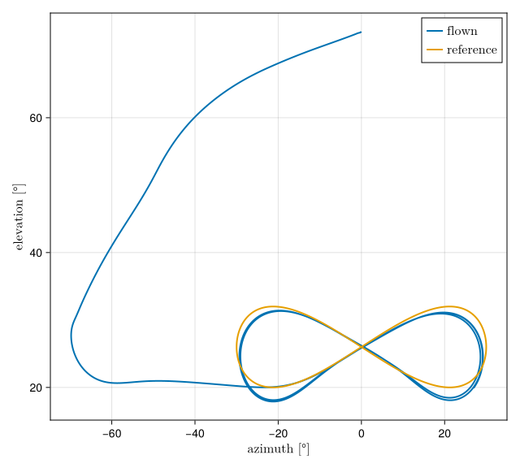

# Examples - figure-of-eight

The runs on this page fly the figure-of-eight pattern at constant tether length. How to install
and start the examples is described on [Examples - general](examples_general.md).

## Figure-of-eight runs

### [`simple_fig8.jl`](https://github.com/OpenSourceAWE/SimpleKiteControllers.jl/blob/main/examples/simple_fig8.jl)
Flies the figure-of-eight pattern at constant tether length. The kite starts parked at about 73°
of elevation and reaches the pattern through a four-phase entry (park, dive, hold, transition).
Once it is engaged, the attractor guidance of [`FigureEightController`](@ref) commands a course
and the [`CourseController`](@ref) tracks it with the steering tape. All tuning parameters come
from the selected project and `data/fc_settings.yaml` ([`FC_Settings`](@ref)). The run writes an
Arrow log to `output/`, named after the project's `log_file` setting, prints the quality metrics
of [`fig8_metrics`](@ref) and plots the results when it is done.

### [`simple_fig8_live.jl`](https://github.com/OpenSourceAWE/SimpleKiteControllers.jl/blob/main/examples/simple_fig8_live.jl)
The same flight as `simple_fig8.jl`, with identical logging and scoring, but shown live in the
KiteViewers 3D window while it flies. The simulation loop drives the viewer directly; apart from
that the two scripts are kept identical.

### [`simple_fig8_plots.jl`](https://github.com/OpenSourceAWE/SimpleKiteControllers.jl/blob/main/examples/simple_fig8_plots.jl)
Re-plots the last log of `simple_fig8.jl` without simulating again: the flown pattern in the
azimuth–elevation plane against the reference lemniscate, a stacked time series (cross-track
error, elevation, heading and course, steering, tether force and length) and the aerodynamics,
as selected with `select_plots.jl`.

### [`simple_opt_fig8.jl`](https://github.com/OpenSourceAWE/SimpleKiteControllers.jl/blob/main/examples/simple_opt_fig8.jl)
Uses the same plant, entry and inner loop as `simple_fig8.jl`, but the reference path comes from
the [AWETrim](https://github.com/awegroup/AWETrim) optimizer instead of from the lemniscate
parameters `f8_a` and `f8_b`. It asks for the power-optimal reel-out path for the run's own
wind and winch, installs it with [`set_path!`](@ref) and flies it at constant tether length.
The lemniscate is still built as the initial guess of the optimizer and as the reference the result is
plotted against. The script starts the optimizer server itself if none is running, and reads its
settings from `data/traj_opt.yaml`. It is the rehearsal for `simple_opt_reelout.jl`.

### [`optimize_path.jl`](https://github.com/OpenSourceAWE/SimpleKiteControllers.jl/blob/main/examples/optimize_path.jl)
A walk-through of the AWETrim client: it asks the optimizer for one path and plots it against
the initial guess. The conditions of the request are typed in to show its structure; a path that
is to be flown must be optimized for the run's own wind and winch, which is what the runs above do.

### [`stability_fig8.jl`](https://github.com/OpenSourceAWE/SimpleKiteControllers.jl/blob/main/examples/stability_fig8.jl)
A disk-margin stability analysis of the linearized course-control loop of `simple_fig8.jl`: the
gain-scheduled PD controller of [`CourseController`](@ref), closed around the steering actuator
and the identified turn-rate law of the V3 kite ([`turn_rate_coeffs`](@ref)), with the guidance as
outer loop. It prints the gain, phase, delay and disk margins over the operating range of the
selected project and needs `ControlSystemsBase`.

## Parking

### [`simple_auto_parking.jl`](https://github.com/OpenSourceAWE/SimpleKiteControllers.jl/blob/main/examples/simple_auto_parking.jl)
Flies an attitude-stabilized parking maneuver. The wing is settled at a fixed depower setting and
held at constant tether length, while a heading PID, gain-scheduled with `1/v_app`, regulates the
heading to zero so that the kite does not drift away from straight-up parking. The run logs to
`output/tmp_auto_parking.arrow` and prints the RMS error of the heading regulation and the ripple
of the angle of attack.

### [`simple_auto_parking_plots.jl`](https://github.com/OpenSourceAWE/SimpleKiteControllers.jl/blob/main/examples/simple_auto_parking_plots.jl)
Re-plots the log of `simple_auto_parking.jl` without simulating again: reel-out speed, tether
force, elevation, heading, angle of attack, the lift-to-drag ratios and the commanded versus the
actual steering.
