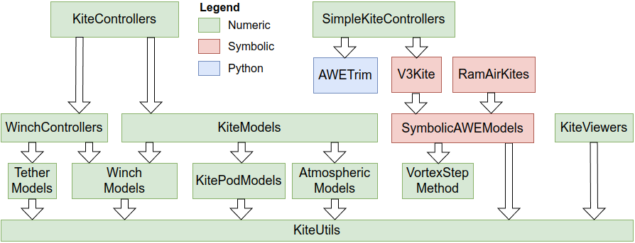

```@meta
CurrentModule = SimpleKiteControllers
```

# SimpleKiteControllers

This package is part of Julia Kite Power Tools, which consists of the following packages:



SimpleKiteControllers also depends on [WinchControllers](https://github.com/OpenSourceAWE/WinchControllers.jl) and [AtmosphericModels](https://github.com/OpenSourceAWE/AtmosphericModels.jl).

## Introduction
This package provides:
- a path following figure of eight controller
- a reel-out controller that produces power by reeling out and flying figures of eight
- a client for the [AWETrim](https://github.com/awegroup/AWETrim) reelout flight-path optimizer

Planned:
- a controller for flying circles

## This package provides
- the figure-of-eight path-following guidance: the types [`FigureEightController`](@ref) and
  [`FigureEightSettings`](@ref) and the functions [`figure_eight_path`](@ref), [`calc_attractor`](@ref),
  [`navigate_fig8`](@ref), [`set_path_center!`](@ref), [`path_tangent`](@ref)
- the figure-of-eight inner loop: the types [`CourseController`](@ref) and
  [`CourseControllerSettings`](@ref), driven by [`calc_steering`](@ref) and [`set_phase!`](@ref) — the
  heading/course PID, entry state machine and `rel_depower`, shared by all three
  `examples/simple_fig8*.jl` scripts
- the curvature feasibility check [`check_pattern_feasible`](@ref) (with [`min_turn_radius`](@ref),
  [`path_min_radius`](@ref), [`path_radius_profile`](@ref)) — a pattern tighter than the kite's minimum
  turn radius cannot be tracked at any PID tuning, so this is worth running before a
  simulation, not after
- [`turn_rate_coeffs`](@ref), the identified turn-rate-law coefficients `c1`, `c2` and steering
  `delay` the feasibility check needs, interpolated in depower from
  `data/turn_rate_coeffs.yaml`
- [`fig8_metrics`](@ref) / [`print_fig8_metrics`](@ref), headless quality metrics for a flown run
- [`FC_Settings`](@ref), every tuning parameter of a figure-of-eight run, loaded from
  `data/fc_settings.yaml`

The examples are described on four pages: [general](examples_general.md), [identification](examples_identification.md),
[figure-of-eight](examples_fig8.md) and [reel-out](examples_reelout.md);
and the docstrings of all exported types and functions are on the [API](api/index.md) page.
The YAML files that make up a run, and how a system project ties them together, are
explained on the [Settings](settings.md) page.

## Further documentation

- [simulation results and video in notebook format](https://opensourceawe.github.io/SimulationResults/)
- [docs/control_algorithm.md](https://github.com/OpenSourceAWE/SimpleKiteControllers.jl/blob/main/docs/control_algorithm.md) — how the controller works, from the
  optimal trajectory through path following and the steering set point to the reel-out speed,
  plus what is and is not verified by the test suite
- [docs/thesis.md](https://github.com/OpenSourceAWE/SimpleKiteControllers.jl/blob/main/docs/thesis.md) — the heading/course fusion ψ' in detail, and how it differs
  from the reference formulation
- [docs/reelout_state_machine.md](https://github.com/OpenSourceAWE/SimpleKiteControllers.jl/blob/main/docs/reelout_state_machine.md) — the flight phases and winch
  states of `examples/simple_reelout.jl`, with the transition conditions
- [docs/fig8_tuning_log.md](https://github.com/OpenSourceAWE/SimpleKiteControllers.jl/blob/main/docs/fig8_tuning_log.md) — the dated record of the parameter
  experiments behind the shipped tuning, including which levers turned out to be dead ends
- [docs/ScratchUsage.md](https://github.com/OpenSourceAWE/SimpleKiteControllers.jl/blob/main/docs/ScratchUsage.md) — startup cost and where the generated model and settling caches land
- [docs/TrajectoryOptimization.md](https://github.com/OpenSourceAWE/SimpleKiteControllers.jl/blob/main/docs/TrajectoryOptimization.md) — notes on the trajectory
  optimization test cases

## License

This project is licensed under the MIT License. Please see the below `Copyright notice` in association with the license that can be found in the file [LICENSE](https://github.com/OpenSourceAWE/SimpleKiteControllers.jl/blob/main/LICENSE).

## Copyright notice

Technische Universiteit Delft hereby disclaims all copyright interest in the package “SimpleKiteControllers.jl” (controllers for airborne wind energy systems) written by the Author(s).

Prof.dr. H.G.C. (Henri) Werij, Dean of Aerospace Engineering, Technische Universiteit Delft.

See the copyright notices in the source files.

## Acknowledgements

This work has been supported by the MERIDIONAL project, which receives funding from the European Union’s Horizon Europe Program under the grant agreement no. [101084216](https://doi.org/10.3030/101084216). The opinions expressed in this document reflect only the author’s view and reflects in no way the European Commission’s opinions. The European Commission is not responsible for any use that may be made of the information it contains.

## Related
- A fully working set of flight path controllers and planners can be found here: [KiteControllers.jl](https://github.com/aenarete/KiteControllers.jl)
- The reel-out flight-path optimizer used by `simple_opt_fig8.jl` and `simple_opt_reelout.jl`: [AWETrim](https://github.com/awegroup/AWETrim)
- The kite model used in the examples (TU Delft V3 kite): [V3Kite.jl](https://github.com/OpenSourceAWE/V3Kite.jl)
